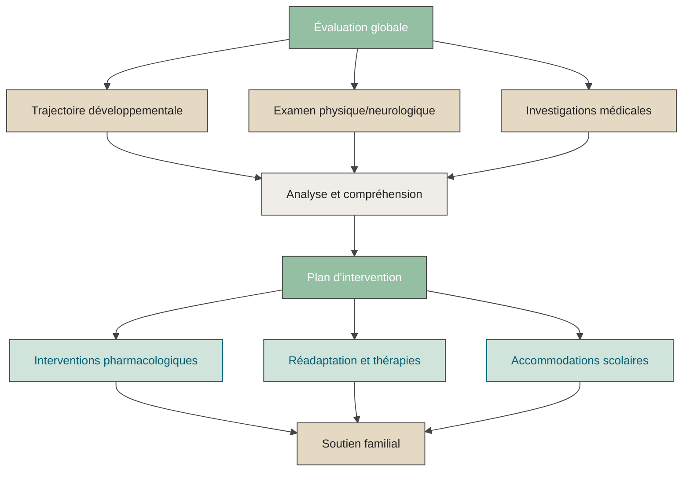




## Ma pratique au CHUSJ et CRME

Je travaille comme pédiatre du développement au CHU Sainte-Justine (CHUSJ) ainsi qu’au Centre de réadaptation Marie Enfant (CRME).

Dans ces centres, j’évalue et accompagne des enfants et adolescent·e·s présentant diverses conditions neurodéveloppementales, notamment :
-	Autisme
-	Déficience intellectuelle
-	Trouble du déficit de l’attention avec ou sans hyperactivité (TDAH)
-	Paralysie cérébrale
-	Troubles d’apprentissage
-	Autres différences ou conditions neurodéveloppementales (ex. : trouble développemental de la coordination, trouble du spectre de l’alcoolisation fœtale, etc.)

J’accompagne également les familles pour soutenir le bien‑être des enfants et adolescent·e·s dont certains comportements ou difficultés peuvent perturber le quotidien. Cette approche tient compte des multiples facteurs pouvant y contribuer, tels que les troubles du sommeil, les difficultés d’alimentation, ou d’autres enjeux fonctionnels.

Au CRME, je participe aux activités de garde clinique pour les enfants hospitalisés à l’unité de réadaptation intensive et à l’unité d’hébergement, et je collabore aux cliniques des maladies neuromusculaires.

---

  <strong>⚠️ Avis important :</strong> 
  Ce site fournit des informations générales sur ma pratique professionnelle et des ressources clinique en lien avec le développement des enfants et adolescents.  
    
  Aucune demande de consultation médicale ou de suivi ne peut être traitée via ce site. Pour une référence ou obtenir un rendez-vous, veuillez suivre les <a href="https://www.chusj.org/fr/soins-services/N/CIRENE/PublicCible/Medecins-et-professionnels/Referencement" target="_blank">démarches officielles du CHU Sainte-Justine. </a>  
    
  Les informations médicales partagées ici sont à visée informative uniquement et ne remplacent pas une évaluation clinique personnalisée. Pour toute question médicale concernant votre enfant, consultez un·e professionnel·le de la santé.

---

## Qu’est-ce que la pédiatrie du développement ?

La pédiatrie du développement est une surspécialité de la pédiatrie.  
Elle est reconnue par le Collège des médecins du Québec et le Collège royal des médecins et chirurgiens du Canada.

Cette spécialité s’adresse aux enfants et adolescent·e·s dont le développement cognitif, langagier, moteur, sensoriel ou socioaffectif est marqué par des différences.

La formation comprend :
- Un doctorat en médecine (MD)
- Une résidence en pédiatrie générale (3 à 4 ans)
- Une surspécialité de 2 ans en pédiatrie du développement

Le pédiatre du développement travaille au sein d’équipes interdisciplinaires composées notamment d’orthophonistes, physiothérapeutes, ergothérapeutes, psychoéducateurs, psychologues, neuropsychologues, travailleurs sociaux et nutritionnistes.

L’évaluation demande une approche globale, souvent schématisée comme suit :

---

## Rôle et missions du pédiatre du développement

Le pédiatre du développement :

- Reconstitue la trajectoire développementale de l’enfant, de la grossesse à aujourd’hui
- Évalue les antécédents médicaux pertinents
- Réalise l’examen physique et neurologique
- Établit un profil clinique à partir des observations, des évaluations et de l’histoire développementale
-	Émet un diagnostic, si nécessaire, ou identifie les variations développementales
-	Détermine les examens ou investigations médicales utiles
-	Recommande des interventions pharmacologiques adaptées (TND et comorbidités)
-	Soutient la famille dans la compréhension du profil de développement, du pronostic et des options thérapeutiques
-	Collabore avec le médecin ou l’infirmier·ère praticien·ne spécialisé·e (IPS) responsable du suivi
-	Propose un plan d’intervention individualisé
-	Rédige les rapports, lettres ou formulaires requis (soutien scolaire, allocations, réadaptation, etc.)
-	Oriente vers des ressources fiables d’information, de soutien ou de répit

---