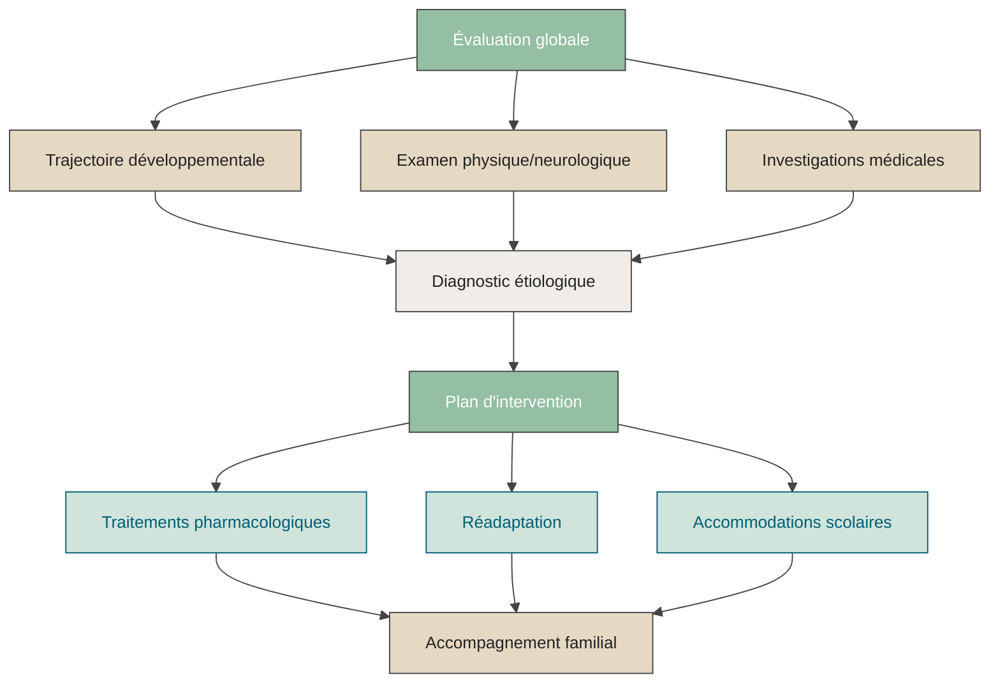




## Ma pratique au CHUSJ et CRME

Je travaille comme **pédiatre du développement** au CHU Sainte-Justine (CHUSJ) ainsi qu’au Centre de réadaptation Marie Enfant (CRME).

Dans ces centres, j’évalue et j’accompagne des enfants et adolescent·e·s présentant diverses conditions neurodéveloppementales, notamment :  
- Autisme  
- Déficience intellectuelle  
- Trouble du déficit de l’attention avec ou sans hyperactivité (TDAH)  
- Paralysie cérébrale  
- Troubles d’apprentissage  
- Autres troubles neurodéveloppementaux (trouble développemental de la coordination, trouble du spectre de l’alcoolisation fœtale, etc.)

J’accompagne également des familles dont les enfants présentent des comportements dérangeants, en considérant les multiples facteurs pouvant y contribuer — comme les troubles du sommeil, les difficultés d’alimentation, ou d’autres enjeux fonctionnels.

Au CRME, je participe aux activités de garde clinique pour les enfants hospitalisés à l’unité de réadaptation intensive et à l’unité d’hébergement. Je collabore aussi aux cliniques des maladies neuromusculaires.

---

  <strong>⚠️ Avis important :</strong> 
  Ce site a pour objectif de fournir des informations générales sur ma pratique clinique et sur le développement des enfants.  
    
  Aucune demande de consultation médicale ne peut être traitée via ce site. Pour obtenir un rendez-vous, veuillez suivre les démarches officielles du CHU Sainte-Justine :  
  👉 <a href="https://www.chusj.org/fr/soins-services/N/CIRENE/PublicCible/Medecins-et-professionnels/Referencement" target="_blank">Faire une demande de consultation</a>  
    
  Les renseignements médicaux partagés ici sont à visée informative seulement et ne remplacent en aucun cas une évaluation clinique personnalisée. En cas de question médicale concernant votre enfant, veuillez consulter un·e professionnel·le de la santé.

---

## La pédiatrie du développement

Parfois méconnue, la pédiatrie du développement est une surspécialité de la pédiatrie.  
Elle est reconnue par le Collège des médecins du Québec et le Collège royal des médecins et chirurgiens du Canada.

Cette spécialité s’adresse aux enfants et adolescent·e·s dont le développement cognitif, langagier, moteur, sensoriel ou socioaffectif est marqué par des différences.

La formation comprend :
- Un doctorat en médecine (MD)
- Une résidence en pédiatrie générale (3 à 4 ans)
- Une surspécialité de 2 ans en pédiatrie du développement

Le pédiatre du développement travaille au sein d’équipes interdisciplinaires composées notamment d’orthophonistes, physiothérapeutes, ergothérapeutes, psychoéducateurs, psychologues, neuropsychologues, travailleurs sociaux et nutritionnistes.

L’évaluation demande une approche globale, souvent schématisée comme suit :

---

## Rôle du pédiatre du développement

En consultation, le pédiatre du développement peut notamment :

- Reconstituer la trajectoire développementale de l’enfant, de la grossesse jusqu’à aujourd’hui  
- Évaluer les antécédents médicaux pertinents  
- Réaliser l’examen physique et neurologique  
- Établir un profil clinique à partir des observations, des évaluations et de l’histoire développementale  
- Émettre un diagnostic, si nécessaire  
- Déterminer les examens ou investigations médicales utiles  
- Recommander des traitements pharmacologiques adaptés (TND et comorbidités)  
- Soutenir la famille dans la compréhension du profil de développement, du pronostic et des options thérapeutiques  
- Collaborer avec le médecin ou l’infirmier·ère praticien·ne spécialisé·e (IPS) responsable du suivi  
- Proposer un plan d’intervention individualisé  
- Rédiger les rapports, lettres ou formulaires requis (soutien scolaire, allocations, réadaptation, etc.)  
- Orienter vers des ressources fiables d'information, de soutien ou de répit

---