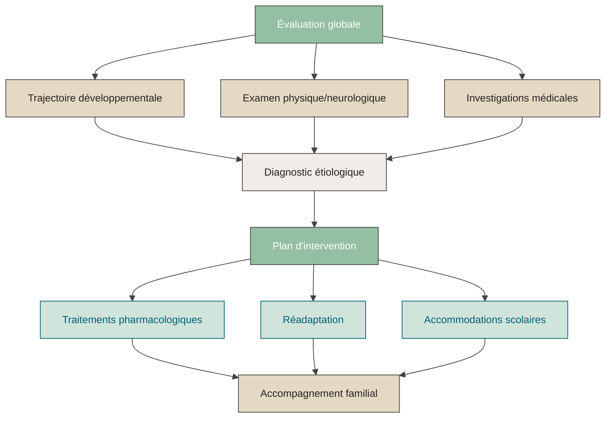





## Pratique clinique

Je travaille comme **pédiatre du développement** au CHU Sainte-Justine ainsi qu’au Centre de réadaptation Marie Enfant.  
Dans ces centres, j’évalue et j’accompagne des enfants et adolescent·e·s présentant diverses conditions neurodéveloppementales, notamment :  
- Autisme  
- Déficience intellectuelle  
- Trouble du déficit de l’attention avec ou sans hyperactivité (TDAH)  
- Paralysie cérébrale  
- Troubles d’apprentissage  

Ma clientèle inclut des enfants et adolescents ayant des parcours variés, souvent marqués par des différences neurodéveloppementales ou des besoins spécifiques.

Si vous souhaitez prendre rendez-vous, veuillez consulter le [portail de prise de rendez-vous du CHU Sainte-Justine](https://www.chusj.org/Patients-et-visiteurs/Prendre-un-rendez-vous).

---

### Le rôle du pédiatre du développement

test

La **pédiatrie du développement** est une spécialité médicale reconnue par le Collège des médecins du Québec et le Collège royal des médecins et chirurgiens du Canada. Elle se consacre à une population d’enfants et d’adolescents dont le développement dans les sphères cognitive, langagière, motrice, sensorielle et socioaffective est atypique ou compromis.

Le pédiatre du développement travaille au sein d’équipes d’évaluation interdisciplinaires composées notamment d’orthophonistes, physiothérapeutes, ergothérapeutes, psychoéducateurs, psychologues, neuropsychologues, travailleurs sociaux et nutritionnistes.

---

### Contribution spécifique du pédiatre du développement

- Reconstituer la trajectoire développementale d’un·e enfant, de la période intra-utérine à aujourd’hui, en tenant compte de tous les facteurs personnels, familiaux et environnementaux.  
- Évaluer l’influence des antécédents médicaux sur le tableau clinique.  
- Réaliser l’examen physique et neurologique.  
- Établir un profil à partir de l’anamnèse médicale, des observations et des évaluations cliniques.  
- Identifier les investigations médicales pertinentes pour établir un diagnostic étiologique.  
- Proposer, si nécessaire, un traitement pharmacologique adapté (TND et comorbidités).  
- Soutenir la famille dans la compréhension du diagnostic, des causes possibles, du pronostic et des options thérapeutiques.  
- Accompagner le médecin ou l’IPS responsable du suivi global de l’enfant, si nécessaire, dans le suivi du traitement pharmacologique recommandé.

---

### Contribution commune au sein de l’équipe interdisciplinaire

- Établir le profil développemental de l’enfant.  
- Poser un diagnostic de trouble neurodéveloppemental (TND).  
- Intégrer les informations issues de l’ensemble des évaluations (présentes et passées).  
- Aider la famille à comprendre le TND, ses impacts, son évolution et son pronostic.  
- Formuler un plan d’intervention en partenariat avec l’enfant et sa famille.  
- Établir des liens avec les intervenants du réseau de la santé et des services sociaux.  
- Documenter les conclusions dans un rapport d’évaluation.  
- Rédiger les lettres et remplir les formulaires requis pour la réadaptation ou le soutien financier.  
- Guider la famille vers des sources fiables d’information et des ressources de soutien ou de répit.

---

*Cette page est destinée aux parents, médecins référents et collègues souhaitant en savoir plus sur ma pratique clinique.*