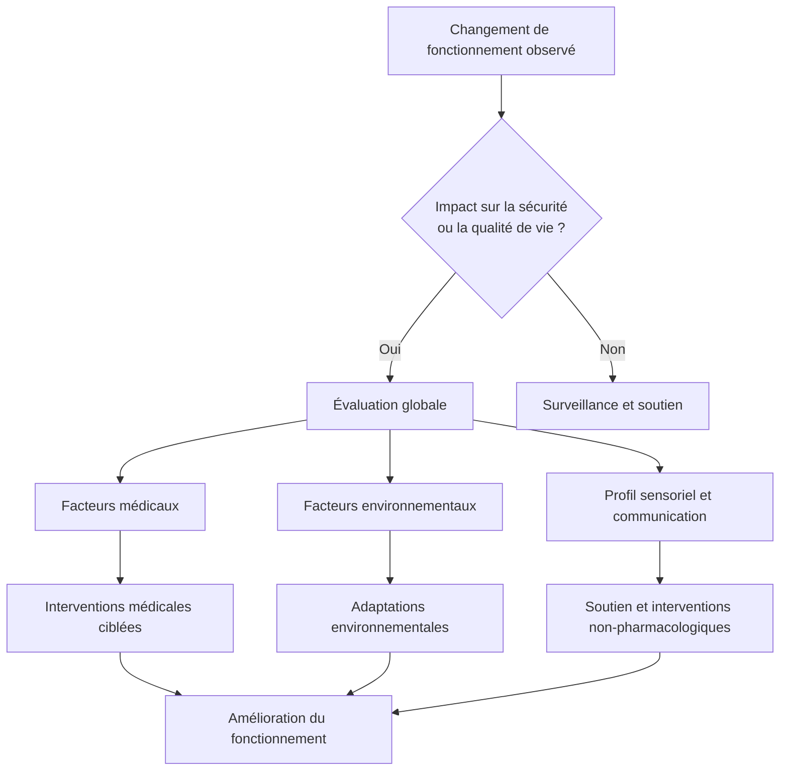

## Introduction

En clinique, les demandes pour des **comportements dits difficiles** ou **perturbateurs** chez les enfants et adolescents autistes sont fréquentes. Les familles consultent souvent après une période de relative stabilité, lorsque « **quelque chose ne fonctionne plus** » : crises plus fréquentes, irritabilité, difficultés d’endormissement ou de maintien du sommeil, retrait ou isolement social, ou comportements qui compromettent la sécurité ou la participation aux activités quotidiennes.

  <strong>Note sur le langage</strong> 
  

    Dans ce texte, les termes <em>comportements perturbateurs</em> ou <em>difficiles</em> sont utilisés à des fins cliniques pour décrire un <strong>impact fonctionnel</strong>. Ils ne visent pas à pathologiser les traits autistiques ni à qualifier l’enfant, mais à soutenir une évaluation globale, rigoureuse et respectueuse de la neurodiversité. Le terme <em>comportements difficiles</em> est utilisé dans une perspective strictement fonctionnelle et clinique, afin de décrire des comportements qui perturbent le fonctionnement adaptatif au quotidien, pour l’enfant et/ou son entourage.
  

Bien que les facteurs non médicaux soient primordiaux à évaluer, ce texte met l’accent sur les **éléments médicaux** à considérer lorsqu’un changement de fonctionnement est observé. Les manifestations sont rarement isolées : des composantes environnementales et médicales coexistent fréquemment. Elles constituent souvent le **signal d’un bris de fonctionnement**, soit un déséquilibre entre les capacités de l’enfant, son environnement et ses besoins physiologiques, sensoriels ou émotionnels.

> *Léo, 11 ans, autiste avec handicap intellectuel, non verbal, communique à l’aide de pictogrammes sur sa tablette. Depuis quelques semaines, ses parents observent une augmentation marquée de son niveau d’activité, des crises quotidiennes et une détérioration importante du sommeil. La famille est épuisée et inquiète.*

Comment aborder ce type de situation de façon rigoureuse, nuancée et respectueuse de la neurodiversité, sans médicaliser à outrance ni banaliser la détresse?

---

## Qu’entend-on par comportements difficiles ou perturbateurs ?

### Est-ce réellement un comportement « perturbateur » ? Pour qui? Pourquoi?

On parle de comportements difficiles ou perturbateurs — ou, de façon plus neutre, de **comportements associés à un bris de fonctionnement** — lorsqu’un comportement **entrave significativement le fonctionnement adaptatif** de l’enfant ou de sa famille. Cela peut inclure :

* agressivité
* crises sévères ou fréquentes
* automutilation
* agitation motrice importante ou rigidité

Chez les enfants autistes, plusieurs comportements s’inscrivent dans un profil neurodéveloppemental diversifié. Ces comportements ne sont pas problématiques en soi et ne doivent pas être considérés comme des « symptômes à éliminer ». Ils peuvent être **adaptatifs**, en aidant l’enfant à se réguler, à se rassurer ou à structurer son environnement. Ils deviennent préoccupants lorsque leur **intensité, leur fréquence ou leur retentissement fonctionnel** augmentent au point de désorganiser la vie quotidienne ou mener à une détresse chez l'enfant.

---

## Un même comportement peut être adaptatif ou signaler un bris de fonctionnement

| Comportement                                   | Peut être adaptatif                                                                    | Peut devenir problématique                     | Critère clé                                 |
| ---------------------------------------------- | ------------------------------------------------------------------------------------------ | -------------------------------------------------- | ------------------------------------------- |
| **Autostimulation / comportements répétitifs** | Effet apaisant Auto-régulation émotionnelle (ex. balancement, répétition de phrases) | Blessures Douleur Entrave à la participation | Impact sur le fonctionnement ou la sécurité |
| **Intérêts spécifiques**                       | Source de motivation Peut favoriser l’engagement social                                 | Isolement Rigidité excessive                    | Flexibilité et retentissement quotidien     |
| **Routines et constance**                      | Environnement prévisible Réduction de l’anxiété                                         | Transitions très difficiles Détresse marquée    | Capacité d’adaptation                       |
| **Réactions sensorielles**                     | Protection sensorielle Effet apaisant                                                   | Évitement sévère Limitation fonctionnelle       | Tolérance et retentissement                 |
| **Comportement moteur élevé**                  | Aide à la régulation                                                                       | Danger physique Désorganisation                 | Sécurité et participation                   |

> **Principe clinique central** : ce n’est pas le comportement en soi qui est problématique, mais son **impact sur le fonctionnement, la sécurité et la qualité de vie**.

Le concept de **bris de fonctionnement** permet ainsi de guider l’évaluation clinique sans pathologiser inutilement les traits autistiques.

---

## Pourquoi un changement de fonctionnement ?

Lorsqu’un enfant autiste présente un changement important de fonctionnement, il est essentiel de considérer **l’ensemble des contextes** susceptibles de l’expliquer. Dans la majorité des cas, un **facteur contributif identifiable** est présent.

### Domaines d’évaluation lors d’un changement de comportement

| Domaine                        | Éléments à explorer                                                                                                                                                                     |
| ------------------------------ | --------------------------------------------------------------------------------------------------------------------------------------------------------------------------------------- |
| **Environnement**              | Milieu familial et scolaire Modifications de routine Changement d’intervenant ou d’enseignant Transitions développementales (ex. puberté) Stress psychosocial, intimidation |
| **Communication et cognition** | Niveau de communication Profil cognitif Expression comportementale de la douleur ou de l’anxiété chez les enfants peu ou non verbaux                                              |
| **Santé mentale**              | TDAH, anxiété, dépression Médications et effets indésirables                                                                                                                         |
| **Santé physique**             | Troubles digestifs Sommeil Carences nutritionnelles Douleurs, infections, épilepsie                                                                                            |

---

## Intégrer les éléments liés à la santé physique

Un principe fondamental en pédiatrie du développement est le suivant : **tout changement de comportement ayant un impact fonctionnel doit mener à l’exclusion de causes médicales traitables**, selon le jugement clinique.

Conditions fréquemment associées à un bris de fonctionnement :

* constipation et troubles digestifs
* reflux gastro-œsophagien
* difficultés de sommeil
* douleurs dentaires
* infections
* épilepsie
* carences nutritionnelles (fer, vitamine D)

### Tableaux cliniques et prise en charge de maladies traitables

| Symptôme           | Diagnostics possibles          | Évaluation                          | Prise en charge                  |
| ------------------ | ------------------------------ | ----------------------------------- | -------------------------------- |
| Douleur abdominale | Constipation                   | Radiographie simple de l’abdomen    | Laxatif (PEG 3350)               |
|                    | Reflux gastro-œsophagien       | Anamnèse (diagnostic thérapeutique) | Inhibiteur de la pompe à protons |
|                    | Obstruction intestinale        | Radiographie simple                 | Orientation chirurgicale         |
|                    | Maladie cœliaque               | Ac anti‑transglutaminase IgA        | Régime sans gluten               |
| Sommeil            | Syndrome des jambes sans repos | Ferritine                           | Supplément de fer                |
|                    | Apnée obstructive du sommeil   | Évaluation clinique                 | Adénoïdectomie                   |
| Fatigue            | Alimentation restrictive       | Bilan sanguin ciblé                 | Suppléments selon carence        |
| Douleur            | Douleur dentaire               | Examen et radiographie              | Référence dentaire               |

---

## Le rôle central du sommeil

Les difficultés de sommeil sont beaucoup plus fréquents chez les enfants autistes et incluent :

* difficultés d’endormissement
* éveils nocturnes fréquents
* éveils matinaux précoces
* parasomnies

Un sommeil non réparateur aggrave les comportements difficiles, réduit la tolérance émotionnelle et augmente le stress parental. Les interventions non pharmacologiques (routine stable, supports visuels, environnement sensoriel adapté) constituent la première étape. La mélatonine peut être envisagée dans certains cas.

---

## Alimentation et carences nutritionnelles

Les difficultés alimentaires sont environ cinq fois plus fréquentes chez les enfants autistes. La sélectivité alimentaire peut entraîner des carences (fer, calcium, protéines), de la constipation et de la fatigue. Une évaluation nutritionnelle précoce peut améliorer significativement le fonctionnement global. Le trouble de l'alimentation évitante/restrictive (ARFID) doit être considéré dans certains cas.

Ressource : **[ASD FEED-Ed](https://hollandbloorview.ca/asd-feed-ed)**
(Holland Bloorview)

---

## Quand référer pour des difficultés d’alimentation

* Risque d’aspiration
* Retard de croissance
* Carences nutritionnelles
* Vomissements persistants
* Répertoire alimentaire très restreint (< 5 aliments)

---

## Approches non pharmacologiques

Une fois les causes médicales exclues ou traitées, l’intervention repose sur :

* routines prévisibles
* cohérence entre les milieux de vie
* stratégies adaptées au profil sensoriel
* soutien parental

L’objectif n’est pas d’éliminer les comportements, mais de **réduire la détresse** et de restaurer un fonctionnement plus stable.

---

## Pharmacothérapie

La médication demeure un **dernier recours**, réservé aux situations de détresse sévère ou de risque pour la sécurité, et toujours intégrée à une approche globale avec un suivi étroit.

---

## Points clés pour la pratique clinique

Chez l’enfant autiste, les comportements difficiles sont rarement le problème principal ; ils constituent le plus souvent le **signal d’un déséquilibre sous-jacent** ou d’un besoin non comblé.

