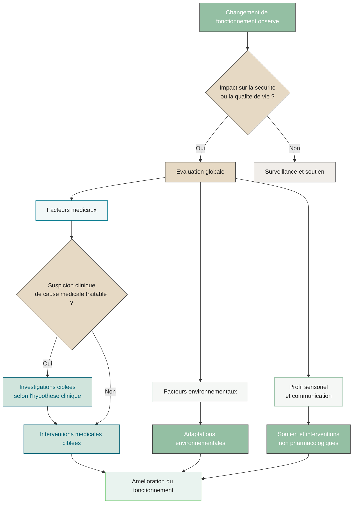

## Introduction

En clinique, les demandes pour des **comportements dits difficiles** ou **perturbateurs** chez les enfants et adolescents autistes sont fréquentes. Les familles consultent souvent après une période de relative stabilité, lorsque « **quelque chose ne fonctionne plus** » : crises plus fréquentes, irritabilité, difficultés d’endormissement ou de maintien du sommeil, retrait ou isolement social, ou comportements qui compromettent la sécurité ou la participation aux activités quotidiennes.

  <strong>Note sur le langage</strong> 
  

    Dans ce texte, les expressions <em>comportements perturbateurs</em> ou <em>comportements difficiles</em> sont employées dans un cadre strictement clinique, visant à décrire un <strong>impact fonctionnel</strong>. Elles ne cherchent en aucun cas à pathologiser des comportements autistiques ni à étiqueter l’enfant. Leur usage permet d'être intégré dans une démarche d’évaluation globale. Ces termes réfèrent  à des comportements qui entravent le fonctionnement adaptatif quotidien, que ce soit pour l’enfant lui-même ou pour son entourage.
  

Bien que les facteurs non médicaux soient primordiaux à évaluer, ce texte met l’accent sur les **éléments médicaux** à considérer lorsqu’un bris de fonctionnement est observé. Les manifestations sont rarement isolées : des composantes environnementales et médicales coexistent fréquemment. Elles constituent souvent le **signal d’un bris de fonctionnement**, soit un déséquilibre entre les capacités de l’enfant, son environnement et ses besoins physiologiques, sensoriels ou émotionnels.

> *Léo, 11 ans, autiste avec handicap intellectuel, non verbal, communique à l’aide de pictogrammes sur sa tablette. Depuis quelques semaines, ses parents observent une augmentation marquée de son niveau d’activité, des crises quotidiennes et une détérioration importante du sommeil. La famille est épuisée et inquiète.*

Comment aborder cet exemple de consultation avec une approche clinique adaptée, rigoureuse, et respectueuse?

---

## Comprendre les comportements difficiles chez l’enfant autiste

### Quand un comportement devient-il problématique ?

On parle de comportements difficiles ou perturbateurs — ou, de façon plus neutre, de **comportements associés à un bris de fonctionnement** — lorsqu’un comportement **entrave significativement le fonctionnement adaptatif** de l’enfant ou de sa famille. Cela peut inclure :

* agressivité
* crises sévères ou fréquentes
* automutilation
* agitation motrice importante ou rigidité

Chez les enfants autistes, plusieurs comportements s’inscrivent dans un profil neurodéveloppemental diversifié. Ces comportements ne sont pas problématiques en soi et ne doivent pas être considérés comme des « symptômes à éliminer ». Bien souvent, ces comportements sont plus souvent qu'autrement **adaptatifs**, permettant à l’enfant de se réguler, se rassurer ou à structurer son environnement. Ils deviennent préoccupants lorsque leur **intensité, leur fréquence ou leur impact sur le fonctionnement** augmentent au point de désorganiser la vie quotidienne ou mener à une détresse chez l'enfant.

---

## Comportements adaptatifs vs signaux de dysfonctionnement

Dans la pratique, un même comportement peut être à la fois adaptatif dans un contexte donné et devenir problématique dans un autre. L’évaluation repose donc sur l’analyse du contexte.

| Comportement                                   | Peut être adaptatif                                                                    | Peut devenir problématique                     | Critère clé                                 |
| ---------------------------------------------- | ------------------------------------------------------------------------------------------ | -------------------------------------------------- | ------------------------------------------- |
| **Comportements répétitifs** | Effet apaisant Auto-régulation émotionnelle (ex. balancement, répétition de phrases) | Blessures Douleur Entrave à la participation | Impact sur le fonctionnement ou la sécurité |
| **Intérêts spécifiques**                       | Source de motivation Peut favoriser l’engagement social                                 | Isolement Rigidité excessive                    | Flexibilité et retentissement quotidien     |
| **Routines et constance**                      | Environnement prévisible Réduction de l’anxiété                                         | Transitions très difficiles Détresse marquée    | Capacité d’adaptation                       |
| **Réactions sensorielles**                     | Protection sensorielle Effet apaisant                                                   | Évitement sévère Limitation fonctionnelle       | Tolérance et retentissement                 |
| **Comportement moteur élevé**                  | Aide à la régulation                                                                       | Danger physique Désorganisation                 | Sécurité et participation                   |

  <strong style="color: var(--info-color); font-size: 1.05rem;">
    Principe clinique central
  </strong>
  

    Ce n’est <strong>pas le comportement en soi</strong> qui est problématique, mais
    lorsque sa présentation entraîne un <strong>impact sur le fonctionnement,
    la sécurité et la qualité de vie</strong> de l’enfant et de sa famille.
  

---

## Identifier les causes d’un changement de fonctionnement

Lorsqu’un enfant autiste présente un changement important de fonctionnement, il est essentiel de considérer **l’ensemble des contextes** susceptibles de l’expliquer. Dans la majorité des cas, un **facteur contributif identifiable** est présent.

### Domaines clés à explorer en clinique

| Domaine                        | Éléments à explorer                                                                                                                                                                     |
| ------------------------------ | --------------------------------------------------------------------------------------------------------------------------------------------------------------------------------------- |
| **Environnement**              | Milieu familial et scolaire Modifications de routine Changement d’intervenant ou d’enseignant Transitions développementales (ex. puberté) Stress psychosocial, intimidation |
| **Communication et cognition** | Niveau de communication Profil cognitif Expression comportementale de la douleur ou de l’anxiété chez les enfants peu ou non verbaux                                              |
| **Santé mentale**              | TDAH, anxiété, dépression Médications et effets indésirables                                                                                                                         |
| **Santé physique**             | Troubles digestifs Sommeil Carences nutritionnelles Douleurs, infections, épilepsie                                                                                            |

---

## L’importance des causes médicales dans les changements comportementaux

Un principe fondamental en pédiatrie du développement est le suivant : **tout changement de comportement ayant un impact fonctionnel doit mener à l’exclusion de causes médicales traitables**, selon le jugement clinique.

Conditions fréquemment associées à un bris de fonctionnement :

* constipation et troubles digestifs
* reflux gastro-œsophagien
* difficultés de sommeil
* douleurs dentaires
* infections
* épilepsie
* carences nutritionnelles (fer, vitamine D)

## Approche clinique des investigations ciblées

L'approche présentée s’inscrit dans une logique de **soins proportionnés**, visant à limiter les investigations inutiles tout en évitant le sous-diagnostic de conditions médicales traitables chez une population à risque de présentation atypique.

Les investigations et le traitement des causes médicales **probables** doivent être guidés par le **jugement clinique**, en fonction de l’histoire, de l’examen physique et du contexte global de l’enfant.

Il n’est **pas indiqué de procéder systématiquement à des investigations d’emblée**. Des examens non ciblés peuvent entraîner un stress important, une détresse inutile, voire un vécu traumatique pour l’enfant, sans bénéfice clinique.

L’approche recommandée privilégie donc des **investigations ciblées**, réalisées uniquement lorsqu’elles sont susceptibles d’orienter la prise en charge ou de modifier le traitement.

### Principaux diagnostics et interventions médicales

| Symptôme           | Diagnostics possibles          | Évaluation                          | Prise en charge                  |
| ------------------ | ------------------------------ | ----------------------------------- | -------------------------------- |
| Douleur abdominale | Constipation                   | Radiographie simple de l’abdomen    | Laxatif (PEG 3350)               |
|                    | Reflux gastro-œsophagien       | Anamnèse (diagnostic thérapeutique) | Inhibiteur de la pompe à protons |
|                    | Obstruction intestinale        | Radiographie simple                 | Orientation chirurgicale         |
|                    | Maladie cœliaque               | Ac anti‑transglutaminase IgA        | Régime sans gluten               |
| Sommeil            | Syndrome des jambes sans repos | Ferritine                           | Supplément de fer                |
|                    | Apnée obstructive du sommeil   | Évaluation clinique                 | Adénoïdectomie                   |
| Fatigue            | Alimentation restrictive       | Bilan sanguin ciblé                 | Suppléments selon carence        |
| Douleur            | Douleur dentaire               | Examen et radiographie              | Référence dentaire               |

---

## Sommeil : un pilier pour le bien-être de l’enfant autiste

Les difficultés de sommeil sont beaucoup plus fréquents chez les enfants autistes et incluent :

* difficultés d’endormissement
* éveils nocturnes fréquents
* éveils matinaux précoces

Un sommeil non réparateur aggrave les comportements difficiles, réduit la tolérance émotionnelle et augmente le stress parental. Les interventions non pharmacologiques (routine stable, supports visuels, environnement sensoriel adapté) constituent la première étape. La mélatonine peut être envisagée dans certains cas.

---

## Difficultés alimentaires et impact nutritionnel

Les difficultés alimentaires sont environ cinq fois plus fréquentes chez les enfants autistes. La sélectivité alimentaire peut entraîner des carences (fer, calcium, protéines), de la constipation et de la fatigue. Une évaluation nutritionnelle précoce peut améliorer significativement le fonctionnement global. Le trouble de l'alimentation évitante/restrictive (ARFID) doit être considéré dans certains cas.

Ressource : **[ASD FEED-Ed](https://hollandbloorview.ca/asd-feed-ed)**
(Holland Bloorview)

---

  <strong>Quand référer pour des difficultés d’alimentation</strong>
  <ul style="margin-top: 0.75rem;">
    <li>Risque d’aspiration (toux, pneumonies récurrentes)</li>
    <li>Retard de croissance ou échec de prise de poids</li>
    <li>Carences nutritionnelles documentées ou suspectées</li>
    <li>Vomissements persistants</li>
    <li>Répertoire alimentaire très restreint (&lt; 5 aliments)</li>
  </ul>

---

## Stratégies non médicamenteuses pour améliorer le fonctionnement

Une fois les causes médicales exclues ou traitées, l’intervention repose sur :

* routines prévisibles
* cohérence entre les milieux de vie
* stratégies adaptées au profil sensoriel
* soutien parental

L’objectif n’est pas d’éliminer les comportements, mais de **réduire la détresse** et de travailler vers un fonctionnement plus stable.

---

## Pharmacothérapie : dernier recours et précautions

Dans l’évaluation globale d’un bris de fonctionnement, il est essentiel de considérer non seulement les causes médicales potentielles, mais aussi les comorbidités, les facteurs environnementaux et leurs traitements possibles. La pharmacothérapie est un sujet complexe qui pourrait faire l’objet d’un billet dédié. Ici, nous soulignons simplement que la médication demeure un **dernier recours**, réservé aux situations de détresse sévère ou de risque pour la sécurité, et doit toujours s’intégrer dans une approche globale avec un suivi clinique attentif.

---

## Synthèse et points clés

Chez l’enfant autiste, les comportements dits difficiles sont rarement le problème principal. Ils constituent le plus souvent un **signal clinique** : celui d’un déséquilibre entre les besoins de l’enfant, ses capacités et son environnement.

Cette approche centrée sur le fonctionnement permet :
- d’éviter la médicalisation excessive,
- de ne pas passer à côté de conditions médicales traitables,
- et d'offrir soutien et support pour l’enfant et sa famille.

Le rôle du clinicien n’est pas de « faire taire » les comportements, mais bien de rechercher **leurs causes probables** et de **comprendre l'enfant** dans ses besoins, afin de mieux orienter les interventions.

---

# Sources bibliographiques

1. Ip A, Zaigenbaum L, Brian JA. La prise en charge et le suivi du trouble du spectre de l’autisme une fois le diagnostic posé. *Paediatr Child Health* 2019; 24(7): 469-77. DOI: 10.1093/pch/pxz122.
2. Fields VL, Soke GN, Reynolds A et coll. Pica, autism, and other disabilities. *Pediatrics* 2021; 147(2): e20200462. DOI: 10.1542/peds.2020-0462.
3. Wasilewska J, Klukowski M. Gastrointestinal symptoms and autism spectrum disorder: links and risks – A possible new overlap syndrome. *Pediatric Health Med Ther* 2015; 6: 153-66. DOI: 10.2147/PHMT.S85717.
4. Devnani PA, Hegde AU. Autism and sleep disorders. *J Pediatr Neurosci* 2015; 10(4): 304-7. DOI: 10.4103/1817-1745.174438.
5. Malow BA, Byars K, Johnson K et coll. A practice pathway for the identification, evaluation, and management of insomnia in children and adolescents with autism spectrum disorders. *Pediatrics* 2012; 130(suppl. 2): S106-S124. DOI: 10.1542/peds.2012-0900I.
6. Smile S, Raffaele C, Perlin R. Re-imagining the physicians’ role in the assessment of feeding challenges in children with autism spectrum disorder. *Paediatr Child Health* 2021; 26(2): e73-e77. DOI: 10.1093/pch/pxaa008.
7. Sharp WG, Berry RC, McCracken C et coll. Feeding problems and nutrient intake in children with autism spectrum disorders: a meta-analysis and comprehensive review of the literature. *J Autism Dev Disord* 2013; 43(9): 2159-73. DOI: 10.1007/s10803-013-1771-5.